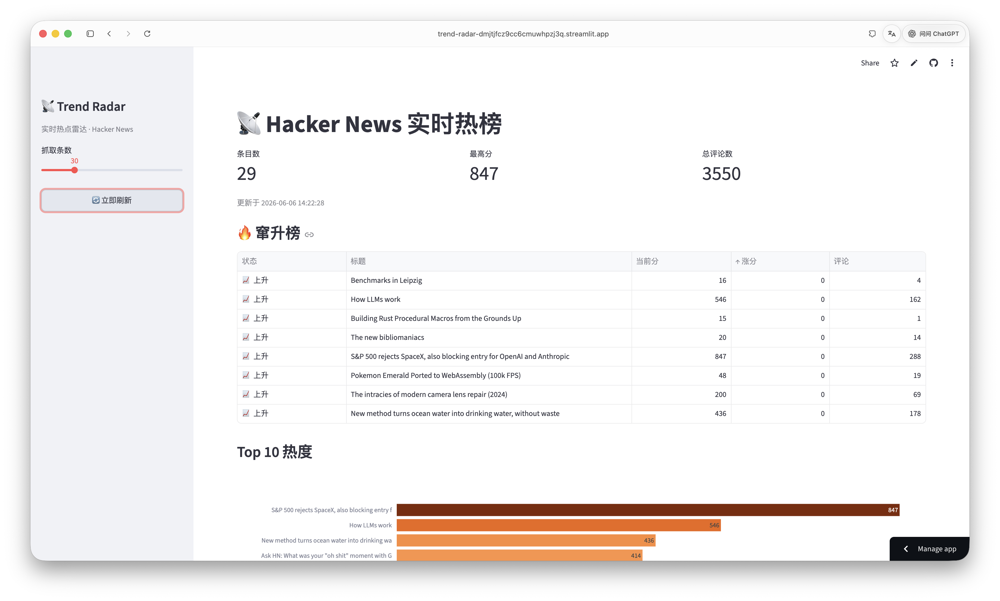

# 📡 Trend Radar

Realtime hot-topic radar for Hacker News — see what's hot **and what's rising fastest**, with live charts and keyword insights.

> Built with Python + Streamlit. Fetches live data, tracks momentum across snapshots, and deploys free on Streamlit Community Cloud.

**[🔗 Live demo](https://trend-radar-dmjtjfcz9cc6cmuwhpzj3q.streamlit.app)**



## Features

- **🔥 Risers board** — diffs consecutive snapshots to surface the stories gaining score fastest, plus brand-new entries. This is the core: it answers *"what's heating up right now?"*, not just *"what's hot"*.
- **Live hot list** — top stories with score, comments, author, and age; refresh on demand.
- **Insights** — title keyword cloud, score-vs-comments scatter, and posting-time distribution.
- **Persistent history** — every fetch is appended to `data/snapshots.csv`; a scheduled GitHub Action keeps capturing, so the risers board works across restarts.

## Tech stack

`Python` · `Streamlit` · `httpx` (concurrent fetch) · `pandas` · `Plotly` · `wordcloud` · `GitHub Actions`

## Run locally

```bash
git clone https://github.com/<you>/trend-radar.git
cd trend-radar
python3 -m venv .venv && source .venv/bin/activate
pip install -r requirements.txt
streamlit run app.py
```

Then open http://localhost:8501.

## How it works

```
HN Firebase API ──▶ radar/sources.py   (concurrent fetch)
                          │
                          ▼
        radar/storage.py  ──▶ data/snapshots.csv   (append-only history)
                          │
                          ▼
        radar/trends.py   (diff latest two snapshots → risers)
                          │
                          ▼
                       app.py   (Streamlit UI)
```

The risers board needs at least two snapshots. Locally each refresh records one; in production the GitHub Action captures hourly.

## Deploy (free)

1. Push this repo to GitHub.
2. Go to [share.streamlit.io](https://share.streamlit.io), connect the repo, and set `app.py` as the entry point.
3. You get a public `*.streamlit.app` URL — paste it at the top of this README.

## Automated capture

`.github/workflows/capture.yml` runs `scripts/capture.py` hourly, appends a snapshot to `data/snapshots.csv`, and commits it — building a persistent history (and proving the radar runs itself 24/7). You can also trigger it manually from the **Actions** tab → **Run workflow**.

## Project structure

```
trend-radar/
├── app.py                  # Streamlit UI
├── radar/
│   ├── sources.py          # Hacker News API client
│   ├── storage.py          # CSV snapshot persistence
│   └── trends.py           # Risers computation
├── scripts/capture.py      # Standalone snapshot capture (used by the Action)
├── .github/workflows/      # Hourly capture workflow
└── requirements.txt
```

## License

Released under the MIT License.
